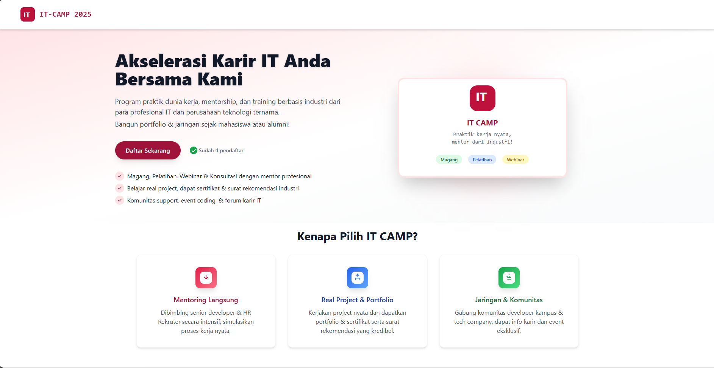
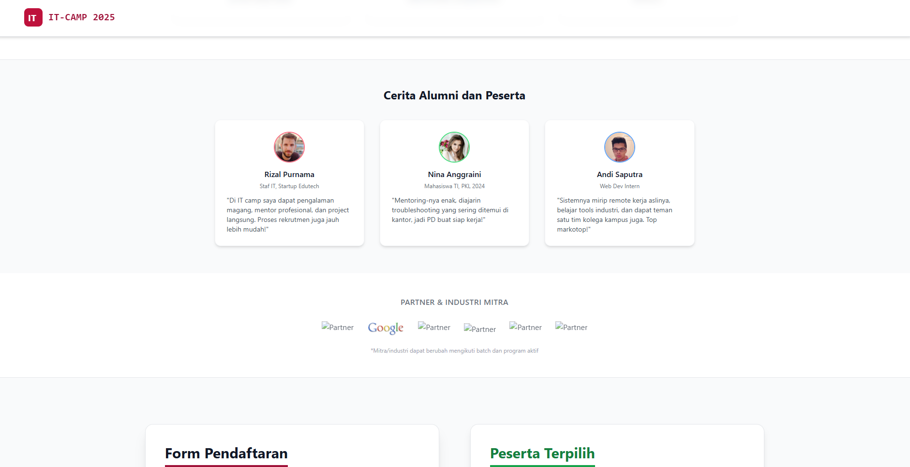
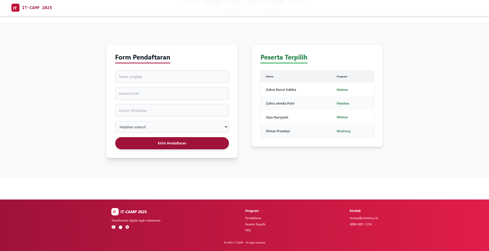
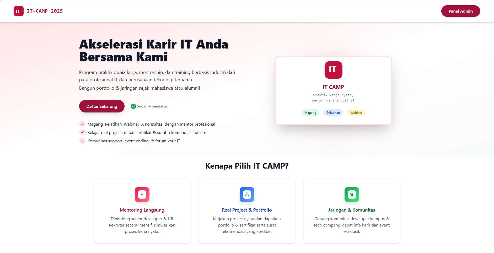
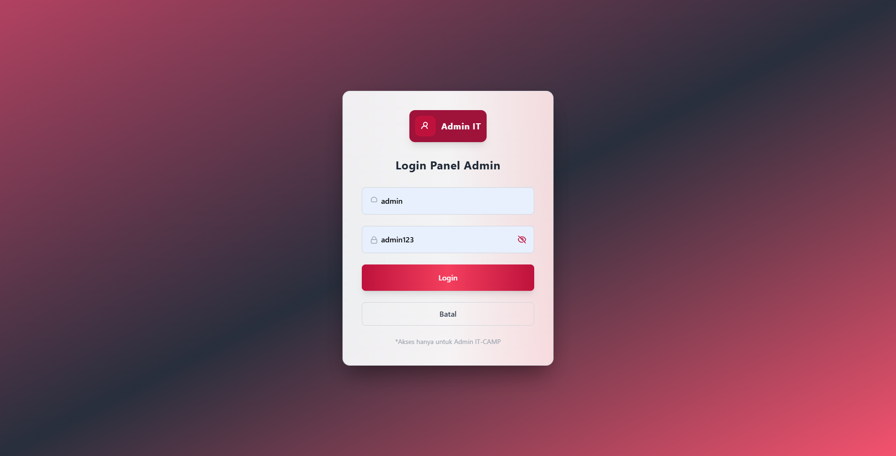
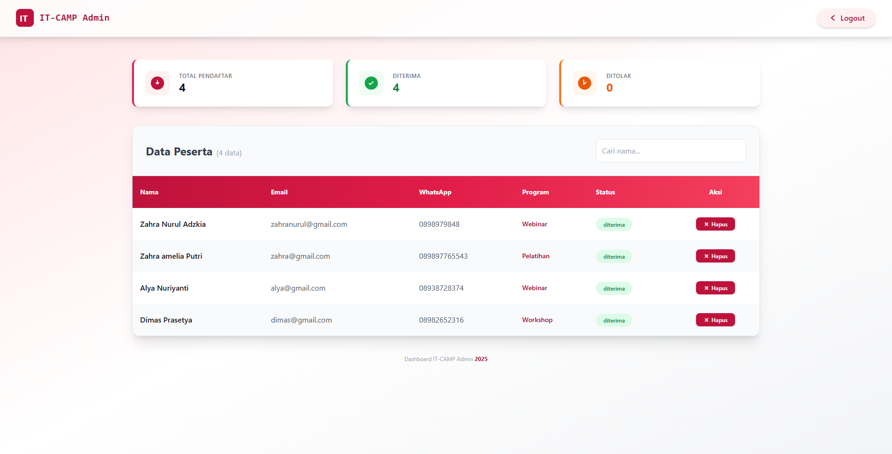

# IT-CAMP 2025 - Sistem Pendaftaran Peserta

Projek ini adalah sistem manajemen pendaftaran peserta IT-CAMP 2025 yang mencakup **Landing Page** untuk pendaftar dan **Dashboard Admin** untuk pengelolaan data peserta.

## 📂 Struktur Project
sistem-pendaftaran-kegiatan/
├── backend/
│   ├── server.js        # File utama server Express
│   ├── package.json     # Dependensi Backend
│   └── database/        # (Opsional) Tempat simpan file .sql
├── frontend/
│   ├── src/
│   │   ├── App.js       # File utama React (UI & Logic)
│   │   └── index.css    # Konfigurasi Tailwind CSS
│   ├── package.json     # Dependensi Frontend
│   └── public/
└── README.md            # Dokumentasi project

## Fitur Utama
- **Landing Page**: Informasi program dan form pendaftaran peserta.
- **Form Pendaftaran**: Validasi data langsung ke database MySQL.
- **Admin Panel**: Login khusus admin untuk mengelola pendaftar.
- **Manajemen Status**: Fitur untuk Menerima atau Menolak peserta (CRUD).
- **Search & Statistik**: Pencarian peserta berdasarkan nama dan ringkasan data pendaftar.

## Teknologi yang Digunakan
- **Frontend**: React.js & Tailwind CSS (UI modern & responsive).
- **Backend**: Node.js & Express.js.
- **Database**: MySQL.
- **HTTP Client**: Axios.

## Persiapan Instalasi

### 1. Database
- Buat database baru bernama `db_pendaftaran` di Laragon/XAMPP.
- Import tabel `users` (untuk login admin) dan `participants` (untuk data pendaftar).

### 2. Backend
1. Masuk ke folder backend: `cd backend`
2. Install dependensi: `npm install`
3. Jalankan server: `node server.js`
4. Server akan berjalan di: `http://localhost:5000`

### 3. Frontend
1. Masuk ke folder frontend: `cd frontend`
2. Install dependensi: `npm install`
3. Jalankan aplikasi: `npm start`
4. Aplikasi akan terbuka di: `http://localhost:3000`

## Akses Admin
Untuk masuk ke panel admin:
- Buka URL: `http://localhost:3000?admin=true`
- Klik tombol **Panel Admin** di navbar.
- Masukkan username & password yang ada di tabel `users`.

## 📷 Dokumentasi Aplikasi

### Landing Page

### Form Pendaftaran

### Landing Page beserta button Panel Admin di Navbar

### Form Login Admin

### Dashboard Admin
